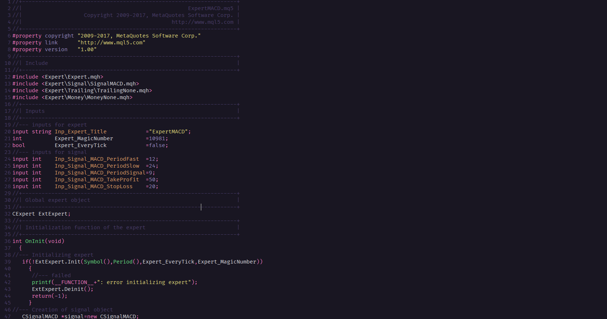

# Omni for [Meta Editor](https://www.metatrader5.com/en/automated-trading/metaeditor)



## Install

#### Install using Git

If you are a git user, you can install the theme and keep up to date by cloning the repo:

    git clone https://github.com/filipelperes/omni-metaeditor.git

#### Install manually

Download using the [GitHub .zip download](https://github.com/filipelperes/omni-metaeditor/archive/main.zip) option and unzip them.

#### Activating theme

1. Open the configuration folder for the Metatrader version you want to change, in MT5 usually at:

```
C:\Users\{YOUR USER}\AppData\Roaming\MetaQuotes\Terminal\{Code}\config
```

2. Add the following lines to the file **metaeditor.ini**   :
```c++
[Colors]
Color0=2233881
Color1=15131105
Color2=15131105
Color3=5062977
Color4=2233881
Color5=13007359
Color6=6765640
Color7=13077400
Color8=13007359
Color9=7986919
Color10=13077400
Color11=8447079
Color12=15131105
Color13=14799224
Color14=6594280
Color15=8716520
Color16=6579300
```
*Replace the `[Colors]` section if it already exists.
  
3. Restart MetaEditor to apply changes

4. Boom! It's working

## [contributors](https://github.com/filipelperes/omni-metaeditor/graphs/contributors)

| [](https://github.com/nmsmith22389) |
| -------------------------------------------------------------------------------------------------------- |
| [filipelperes](https://github.com/filipelperes)                                                             |